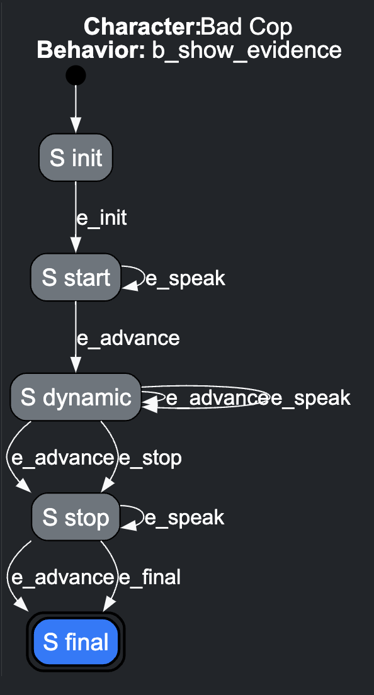

# Documentation for Creating a New Behavior

This guide explains how to write a new behavior using the provided YAML structure and describes the types of states, events, and configuration options. 

## **Example Behavior YAML**

Below is an example YAML file for a behavior (these elements are defined in [Structure of a Behavior](#structure-of-a-behavior)):

```yaml
meta:
  name: BadCop
  loop: true
  randomize: false
  max-iterations: 2

init:
  meatstate: "think"
  emotion: "anger"

dynamic:
  automatic:
    prompt:
      - _PERSONA
      - _FEW_SHOTS
      - Now you are in a conversation with another suspect.
      - This has been your conversation so far.
      - _CHAT_HISTORY
      - Continue the conversation, but threaten the suspect that you will throw them to the sharks if they do not confess.
      - Speak using only one sentence, and be concise.
    emotion: angry
    azure_style: "Angry"

end:
  success:
    speak:
    - "I knew it!"
  failure:
    speak:
    - "We are not getting anywhere."
```

You can check a small example of dialogue between a good cop / bad cop for New York and a car thief from Texas using the example of scenes, behaviours and persona in folder `scripts/good_cop_bad_cop`.
```sh
python run_friendly.py --mode=simulation --script_dir=scripts/good_cop_bad_cop --user_behaviour=suspect
```

Here’s a conversation based on that particular set of YAML files (scene `s_threaten.yaml`, behavior `b_bad_cop.yaml`, persona `Bad Cop.txt`, few-shot prompts `bad-cop.txt`):
```
------s_threaten------
[Bad Cop: MeatState think]
Patient: I swear on my boots, I don’t know nothin’ 'bout that car, just like a tumbleweed knowin' the desert!
Bad Cop: Listen here, cowboy, if you don’t spill the beans, I’ll make sure you swim with the sharks and they ain't bringin' you back, capiche?
Patient: Well, shoot, I ain’t never seen that feller in my life, partner, and I ain’t got no reason to be spillin’ no beans!
Bad Cop: You keep holdin’ out on me, and I’ll toss you into the East River as a shark snack, you got that?
Patient: Well, it ain’t right to be accusin’ me of such things, ’cause I ain't got nothin' to do with that fancy car!
Bad Cop: We are not getting anywhere.
Patient: Well, now, howdy there, I reckon that's a right nice picture, but I ain't ever met that car before!
------s_evidence------
```

## **Structure of a Behavior**
A behavior is described in YAML format and defines the following:
1. **Meta Information**: General metadata about the behavior, including parameters like `name`, `loop`, `randomize`, and `max_iterations`.
2. **States**: `init`, `dynamic`, `end`, and `override` states.
3. **Events**: Actions that occur in these states, including speech, animations, and prompts. If no event is requested, the default tag for that class is used.

### **Behavior States**
| **State**    | **Description**                                                                                   | **Default Tag** | **Special Behaviors**                                                                                                             |
|--------------|---------------------------------------------------------------------------------------------------|-----------------|----------------------------------------------------------------------------------------------------------------------------------|
| **`init`**   | The initialization state, where setup and introductory events are defined.                        | `init`          | Events in `init` are fired automatically when the behavior starts.                                                              |
| **`dynamic`**| The primary operational state, handling iterative or random events.                               | `automatic`     | Supports configurations like `loop`, `randomize`, and `max_iterations`.                                                         |
| **`end`**    | The terminal state, handling cleanup or conclusion events.                                        | `end`           | Can specify multiple end conditions, e.g., `success`, `failure`.                                                                |
| **`override`**| A custom state for manually triggered transitions.                                                | Customizable    | Allows external input to jump directly to predefined events. Useful for interrupting or overriding default behavior workflows.   |

---

## **Behavior States Overview**

This diagram shows a behavior's states and their transitions.



---

### **1. `init` State**
```yaml
init:
  meatstate: "think"
  emotion: "anger"
```

### **2. `dynamic` State**
```yaml
meta:
  loop: true
  randomize: false
  max-iterations: 2

dynamic:
  automatic:
    prompt:
      - _PERSONA
      - _FEW_SHOTS
      - Now you are in a conversation with another suspect.
      - This has been your conversation so far.
      - _CHAT_HISTORY
      - Continue the conversation, but threaten the suspect that you will throw them to the sharks if they do not confess.
      - Speak using only one sentence, and be concise.
    emotion: angry
    azure_style: "Angry"
```

Note that in the prompt above, there are specific placeholders `_PERSONA`, `_FEW_SHOTS` and `_CHAT_HISTORY` that will be filled with the persona and few-shot prompts information from the scene, and the chat history so far.


### **3. `end` State**
```yaml
end:
  end:
    speak: ["We are not getting anywhere."]
```

### **4. `override` State**
You could also have overriding states, like:
```yaml
override:
  emergency:
    - speak:
        speak: ["Put that gun down!"]
        emotion: "fear"
  alternative_path:
    - speak:
        speak: ["Switching to a different strategy."]
        azure_style: "Neutral"
```

---

## **Event Formats**


- Events must have one and only one of the following keys: `speak`, `prompt`, `meatstate`. Each key corresponds to a specific type of event.
- Events may also include optional properties like `emotion`, `azure_style`, `preanimation`, and `postanimation` to enhance the character's expressions and actions.
- Events are supplied as a dictionary with the key corresponding to the event name. If there is no name default for that behavior state will be used. These dictionaries may contain nested lists of events to be selected from.


1. **Simple List of Events**
   ```yaml
   init:
     - speak: "Hi there!"
     - speak: "How can I help you?"
   ```
   - A list where each entry is a dictionary with a single key (e.g., `speak`, `prompt`).
   - Example:
     - Key: `speak`
     - Value: Event details (e.g., sentences to speak).

   If no named event is provided, the default tag is used (`init` in this case). So the above is equivalent to:

   ```yaml
   init:
     init:
       - speak: "The doctor will see you now."
         role: "clerk"
       - speak: "Hi there!"
       - speak: "How can I help you?"
   ```

2. **Dictionary of Keyed Events**
   ```yaml
   end:
     end:
        prompt: ["Say goodbye to end the session."]
     manual_s_panic:
        speak: "There was an issue."
   ```
   - Events are grouped under keys (`end`, `manual_s_panic`), allowing differentiation between event types or scenarios. 
   - For `end` states, the `end` condition will be triggered by default, but if a `manual_s_panic` event is generated by the `SceneManager` this event will be triggered instead.

3. **Nested Dictionary**
   ```yaml
   dynamic:
     automatic:
       - speak: "Task completed successfully."
         emoion: "joy"
       - prompt: ["What would you like to do next?"]
         emotion: "neutral"
     failure:
       speak: "There was an issue."
   ```
   - Defines lists of events under keys like `automatic` or `failure`. I

4. **Single Event**
   ```yaml
   init:
     speak: "Starting the process."
   ```
   - For simple cases where a state contains a single event.

---

### **Event Components**

This are the main event types available.

| **Component** | **Tag**     | **Allowed Values**                                                                     | **Description**                                    |
|---------------|-------------|----------------------------------------------------------------------------------------|----------------------------------------------------|
| **MeatState** | `meatstate` | `idle`, `think`, `speak`, `listen`                                                     | Represents the character's internal state.         |
| **Prompt**    | `prompt`    | Nested lists of strings, e.g., `[["What would you like to do?", "How can I assist?"]]` | Defines instructions or questions for interaction. |
| **Speak**     | `speak`     | List of strings, e.g., `["Hello!", "Hi there!"]`                                       | Represents phrases to be chosen from.                   |


### **Optional Event Properties**

The properties can be associated with some event types.

| **Component**      | **Event Type**    | **Tag**                        | **Allowed Values**                                                                                                           | **Description**                                                 |
|--------------------|-------------------|--------------------------------|------------------------------------------------------------------------------------------------------------------------------|-----------------------------------------------------------------|
| **Emotion**        | `prompt`, `speak` | `emotion`                      | `neutral`, `anger`, `fear`, `sad`, `joy`, `disgust`                                                                          | Defines the emotional tone of the character's speech or action. |
| **Speaking Style** | `prompt`, `speak` | `azure_style`                  | `Default`, `Sad`, `Cheerful`, `Terrified`, `Unfriendly`, `Angry`, `Excited`, `Shouting`, `Whispering`, `Friendly`, `Hopeful` | Specifies the speech style for text-to-speech.                  |
| **Animation**      | `prompt`, `speak` | `preanimation`/`postanimation` | `eyeroll`, `shirtcheck`, `steam`, `lookleftright`, `smile`, `shrug`, `weary`, etc.                                           | Defines pre/post animations to enhance character actions.       |
| **Role**           | `prompt`, `speak` | `role`                         | `mask`, `clerk`                                                                                                              | Represents the character's role during the interaction.         |


### **1. `speak` Event**
Used to define sentences or phrases to be spoken.
```yaml
speak: ["Hello!", "Welcome!"]
azure_style: "Cheerful"  # Optional speaking style
emotion: "joy"           # Optional emotion
preanimation: "smile"    # Optional pre-animation
postanimation: "nod"     # Optional post-animation
```
- **`speak`**: List of sentences that will make up the words to speak.
- **Optional Properties**:
  - **`azure_style`**: Speaking style (e.g., `Cheerful`, `Angry`).
  - **`emotion`**: Emotion to convey (e.g., `joy`, `sadness`).
  - **`preanimation`/`postanimation`**: Animations to play before or after speaking.

---

### **2. `prompt` Event**
Defines prompts for interactive or LLM-based responses.
```yaml
prompt: [["What would you like to do?", "How can I assist?"]]
azure_style: "Friendly"
emotion: "neutral"
```
- **`prompt`**: A list of instructions, where nested lists indicate optional variations.
- **Optional Properties**:
  - **`azure_style`**: Speaking style (e.g., `Cheerful`, `Angry`).
  - **`emotion`**: Emotion to convey (e.g., `joy`, `sadness`).
  - **`preanimation`/`postanimation`**: Animations to play before or after speaking.

---


### **3. `meatstate` Event**
Defines a specific state for the character (e.g., idle, thinking).
```yaml
meatstate: "think"
```

---


## **Dynamic Behavior Configurations**

The `dynamic` state allows more flexible and repeatable interactions through the following parameters:

| **Parameter**       | **Description**                                                                                                   | **Example**                                                                                                                                                                  |
|---------------------|-------------------------------------------------------------------------------------------------------------------|----------------------------------------------------------------------------------------------------------------------------------------------------------------------------|
| **`loop`**          | If `true`, the events in the `dynamic` state will loop indefinitely.                                             | ```yaml dynamic: loop: true ```                                                                                                                                            |
| **`randomize`**     | If `true`, the events in the `dynamic` state will be processed in random order.                                  | ```yaml dynamic: randomize: true ```                                                                                                                                       |
| **`max_iterations`**| Limits the number of times the events are processed in the `dynamic` state.                                      | ```yaml dynamic: max_iterations: 3 ```                                                                                                               
